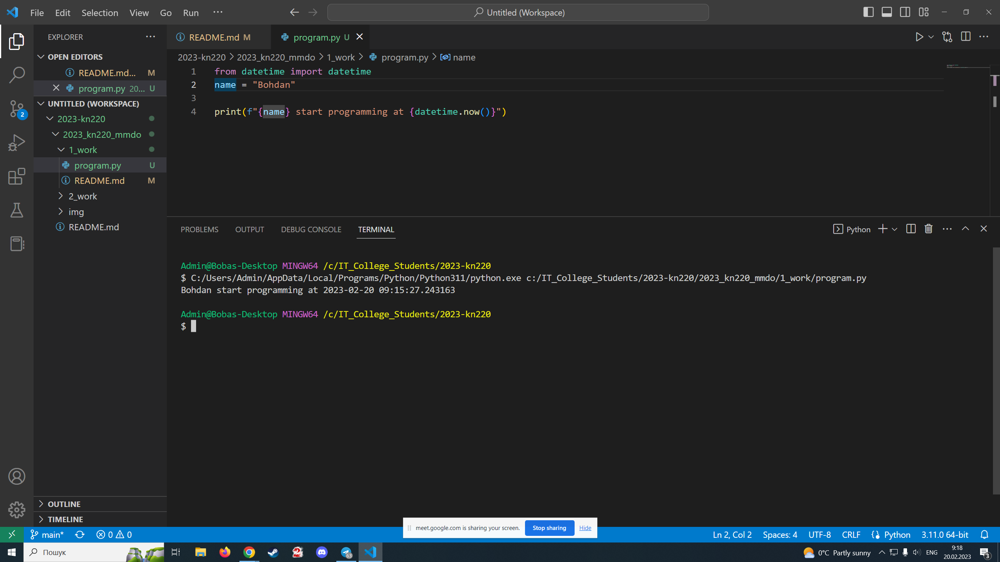
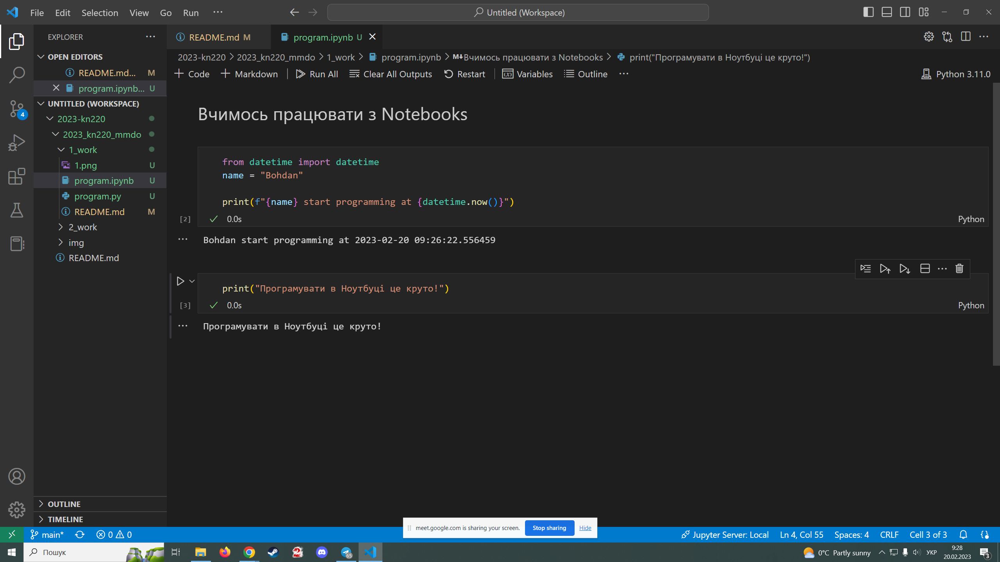
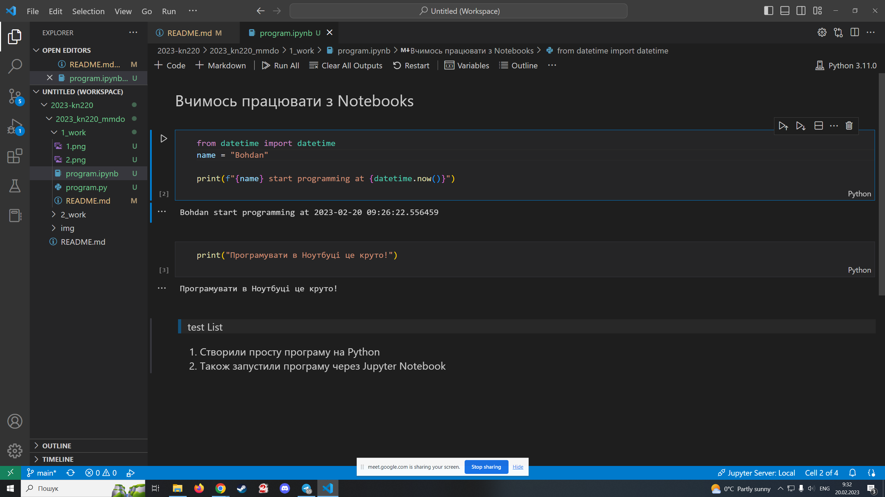

# Звіт до роботи № 1

## Тема: _Оформлення та здача робіт_

### Мета роботи: _виконати всі завдання та навчитись оформляти роботи_

---

### Виконання роботи

- Результати виконання завдання *1...N*;
    1. Встановили плагіни `Python` та `Jupyter`;
    1. Запустили програму на Python. Результат на скріні:
        
    2. Створили Jupyter Notebook та запустили програму. Результат на скріні:
        
    3. Навчились працювати з комірками Markdown  в Ноутбуці. Результат на скріні:
        

- Всі завдання з зірочками були виконані;

### Висновок: 
> у висновку потрібно відповісти на запитання:
- :question: Що зроблено в роботі: налаштували робоче середовище для виконання Python  програм, створили потрібні файли та перевірили виконання програм на Python. оформили першу роботу.
- :question: Чи досягнуто мети роботи: так, досягли, робота оформлена;
- :question: Які нові знання отримано: вперше запустив програму на Python;
- :question: Чи вдалось відповісти на всі питання задані в ході роботи: так. зробили всі скріншоти;
- :question: Чи вдалося виконати всі завдання: так, всі програми запустились;
- :question: Чи виникли складності у виконанні завдання: ні, все запустилось;
- :question: Чи подобається такий формат здачі роботи (Feedback): 
- :question: Побажання для покращення (Suggestions): 
---

